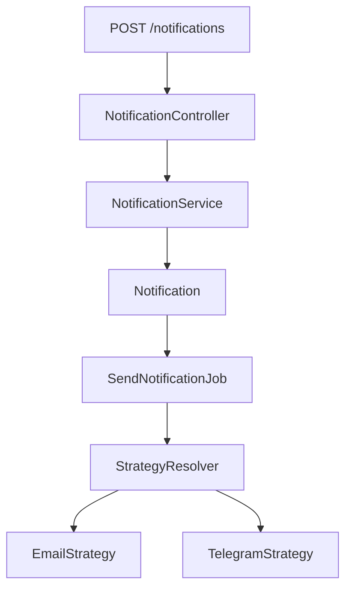

# Notification Service

REST API для создания и асинхронной обработки уведомлений.

Проект реализован на Laravel и демонстрирует построение расширяемой архитектуры с использованием очередей, паттерна Strategy и разделения бизнес-логики по слоям. Уведомления создаются через API, обрабатываются асинхронно и поддерживают механизм повторных попыток доставки при возникновении ошибок.

---

# Features

* Создание уведомлений через REST API
* Получение списка уведомлений
* Получение уведомления по идентификатору
* Фильтрация уведомлений по:

    * пользователю;
    * статусу;
    * каналу доставки
* Асинхронная обработка через Laravel Queue
* Поддержка нескольких каналов доставки
* Повторные попытки отправки
* Обработка ошибок доставки
* Планировщик обработки ожидающих уведомлений

---

# Используемые технологии

* PHP 8.x
* Laravel
* PostgreSQL
* Docker & Docker Compose
* PHPUnit
* PHPStan + Larastan
* Laravel Pint

---

# Структура проекта

```text
app/
├── Console/
│   └── Commands/
├── DTO/
├── Enums/
├── Http/
├── Jobs/
├── Models/
├── NotificationChannels/
│   ├── ChannelStrategy.php
│   ├── EmailStrategy.php
│   ├── TelegramStrategy.php
│   └── StrategyResolver.php
├── Services/
└── ...
```

---

# Установка

Клонировать репозиторий:

```bash
git clone git@github.com:kitte1105/laravel-notification-service.git
cd laravel-notification-service
```

Создать файл окружения:

```bash
cp .env.example .env
```

Настроить подключение к базе данных в `.env`:

```dotenv
DB_CONNECTION=pgsql
DB_HOST=postgres
DB_PORT=5432
DB_DATABASE=notifications
DB_USERNAME=laravel
DB_PASSWORD=secret
```

Запустить контейнеры:

```bash
docker compose up -d
```

Установить зависимости:

```bash
docker compose exec app composer install
```

Сгенерировать ключ приложения:

```bash
docker compose exec app php artisan key:generate
```

Выполнить миграции:

```bash
docker compose exec app php artisan migrate
```

Заполнить тестовыми данными:

```bash
docker compose exec app php artisan db:seed
```

---

# Запуск обработчика очереди

```bash
docker compose exec app php artisan queue:work
```

---

# Запуск планировщика

В проекте используется команда:

```php
Schedule::command('app:process-notifications')
    ->everyMinute();
```

Для локального запуска планировщика:

```bash
docker compose exec app php artisan schedule:work
```

---

# Запуск тестов

Запустить все тесты:

```bash
docker compose exec app php artisan test
```

---

# Статический анализ

Проект использует PHPStan с расширением Larastan. Используемый уровень анализа: 5

Запуск анализа:

```bash
docker compose exec app composer analyse
```

# Проверка Code Style

Для форматирования используется Laravel Pint.

Запуск:

```bash
docker compose exec app composer pint
```
---

# Архитектурные решения

## Слой сервисов

Бизнес-логика создания уведомлений вынесена из контроллеров в отдельный сервис.

```text
Controller
      │
      ▼
NotificationService
      │
      ▼
Notification
```

Такой подход позволяет:

* оставить контроллеры максимально простыми;
* изолировать бизнес-логику;
* упростить тестирование и сопровождение.

---

## DTO

Для передачи данных используется объект `NotificationData`.

```text
Request
    │
    ▼
NotificationData
    │
    ▼
NotificationService
```

Использование DTO позволяет явно определить контракт между HTTP-слоем и бизнес-логикой и отказаться от передачи неструктурированных массивов.

---

## Асинхронная обработка

Отправка уведомлений выполняется через очередь Laravel.

```text
NotificationService
        │
        ▼
SendNotificationJob
```

Такой подход позволяет:

* не блокировать HTTP-запрос;
* выполнять доставку в фоне;
* повторять отправку при возникновении ошибок.

---

## Паттерн Strategy

Для каждого канала доставки используется собственная стратегия.

```text
                 ChannelStrategy
                        │
        ┌───────────────┴───────────────┐
        │                               │
 EmailStrategy                 TelegramStrategy
```

Выбор стратегии выполняет `StrategyResolver`.

Это позволяет легко добавить новый канал доставки без изменения существующей логики обработки уведомлений.

---

## Процесс обработки уведомления



---

## Механизм повторных попыток

Для каждого уведомления сохраняются:

* текущий статус;
* количество попыток отправки;
* время последней попытки;
* текст последней ошибки.

Успешная обработка:

```text
Pending
   │
   ▼
Processing
   │
   ▼
Sent
```

Если во время отправки возникает ошибка:

```text
Processing
      │
      ▼
Pending
      │
      ▼
Повторная попытка
```

Если превышено максимальное количество попыток:

```text
Processing
      │
      ▼
Failed
```

Таким образом обеспечивается автоматическая повторная отправка уведомлений до достижения установленного лимита попыток.

---

# API

Проект создан на Laravel 13. API-маршруты подключены вручную в bootstrap/app.php, так как аутентификация не требуется и пакет API не устанавливался.


| Метод | Endpoint                  | Описание                               |
| ----- | ------------------------- | -------------------------------------- |
| POST  | `/api/notifications`      | Создать уведомление                    |
| GET   | `/api/notifications`      | Получить список уведомлений            |
| GET   | `/api/notifications/{id}` | Получить уведомление по идентификатору |

---

# Тестирование

Проект содержит:

### Feature тесты

* API
* Jobs
* Services
* Commands
* Models

### Unit тесты

* DTO
* Strategy Resolver

---

# Возможные улучшения

Если бы проект разрабатывался для production, я бы дополнительно реализовала:

* Интеграцию с реальными сервисами доставки Email и Telegram.
* Хранение истории каждой попытки доставки в отдельной таблице `notification_attempts`.
* Разделение очередей по каналам доставки (Email, Telegram и т.д.).
* Сбор метрик и настройку оповещений при увеличении количества неудачных отправок.
* Ограничение скорости отправки (rate limiting) для внешних сервисов.
* Логирование запросов и ответов внешних API для упрощения диагностики и аудита.
